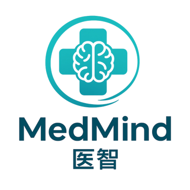
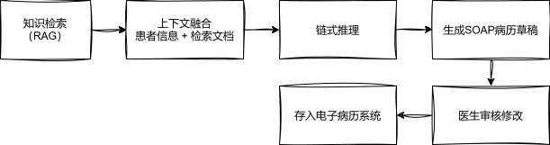
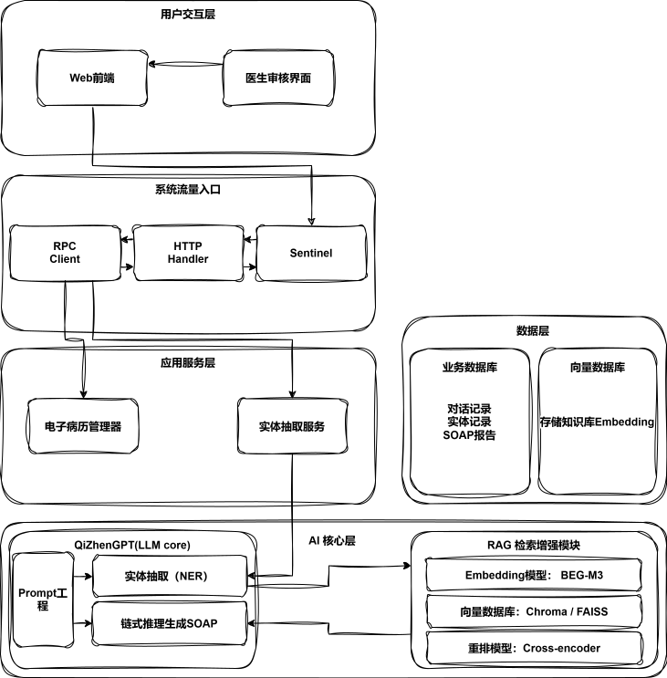

# MediMeowtAgent
<!-- ALL-CONTRIBUTORS-BADGE:START - Do not remove or modify this section -->
[](#contributors-)
<!-- ALL-CONTRIBUTORS-BADGE:END -->

<p align="center">
<!-- 这里你可以放上你们超棒的Logo图片URL -->

</p>

<p align="center">
  <strong>基于LLM智能体的医院预诊系统</strong>
  <br>
  <em>“让信息多跑路，让医生少写字。” — “让 AI 先问诊，让医生更专注。”</em>
</p>

<p align="center">


</p>

## 🎯 项目简介 (Introduction)

**MedMind (医智)** 是一款基于大语言模型（LLM）的智能预诊与病历生成系统。它致力于帮助医院实现“AI辅助采集病情 → 医生快速审核诊断”的高效闭环，将医生从繁琐的重复性文书工作中解放出来，让他们能更专注于诊断与治疗本身。

## 😫 解决的痛点 (The Problem)

* **医生端**: 需花费大量时间进行重复性问询和繁琐的病历录入，有效诊疗时间被压缩。
* **患者端**: 候诊时间长，面诊时紧张，常常无法规范、完整地描述病情。
* **机构端**: 临床文书多为非结构化数据，导致“信息孤岛”，数据难以复用。

## 💡 核心流程 (Core Flow)

我们的解决方案是一个**人机协同**的**两阶段**流程：

### 阶段一：实体抽取与人工校对 (Human-in-the-Loop)

此阶段的目标是获取到医生确认过的、准确无误的病情实体。

<!-- {width="400"} -->


1.  **患者输入**: 患者使用自然语言描述症状。
2.  **AI 抽取**: QiZhenGPT 执行首次 `NER` (命名实体识别)，抽取关键实体。
3.  **医生审核**: 医生在界面上审核高亮的实体，进行 `校对、增删、反馈`。
4.  **循环迭代**:
    * 如果信息不完整，医生可“打回重问”，患者补充回答。
    * 系统 `融合多轮信息`，再次提交给AI进行NER，直至医生确认信息完整。

### 阶段二：RAG + ReAct 生成SOAP报告

此阶段的目标是基于准确的实体，生成专业、规范的病历草稿。

<!--  -->


1.  **确认实体**: 系统使用一阶段确认的实体列表。
2.  **RAG检索**: 根据实体 `向量检索结构化知识` (如医学指南、知识库)。
3.  **LLM 推理**: QiZhenGPT 读取完整的 `对话历史` 和 `检索到的文本`。
4.  **ReAct 生成**: 采用 `ReAct 链式推理` 范式，生成专业的 `S` (主诉)、`O` (客观发现)、`A` (评估) 段落。
5.  **医生补全**: AI生成草稿后，最后由医生补全 `P` (计划) 段落，形成最终的权威病历。

## 🏗️ 系统架构 (Architecture)

本项目采用先进的五层分层架构，确保系统的高内聚、低耦合与高可扩展性。

**(系统架构图)**
<!--  -->


* **用户交互层**: `Web前端` (患者端) 和 `医生审核界面`。
* **系统流量入口**: `HTTP Handler`、`Sentinel` (流量防护)、`RPC Client` (内部通信)。
* **应用服务层**: `对话状态管理器` 和 `实体抽取服务`。
* **数据层**: `业务数据库 (PostgreSQL)` 和 `向量数据库 (Chroma / FAISS)`。
* **AI 核心层**: `QiZhenGPT (LLM Core)` 和 `RAG 检索增强模块`。

## 🛠️ 技术栈 (Tech Stack)

喵喵喵

## 🚀 快速开始 (Getting Started)

```bash
现在还开始不了哦
```

## Contributors ✨

[CONTRIBUTER](/docs/CONTRIBUTER.md)
