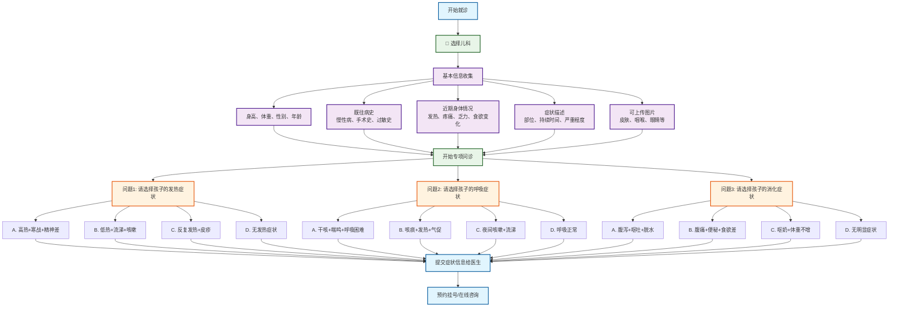

# 儿科分诊流程图

## 儿科专项问诊

### 问题设计（选择题格式）
1. **问题1 - 发热症状选择**：
   - A. 高热+寒战+精神差 → 急性感染性疾病
   - B. 低热+流涕+咳嗽 → 普通感冒
   - C. 反复发热+皮疹 → 儿童传染病
   - D. 无发热 → 继续下一问题

2. **问题2 - 呼吸症状选择**：
   - A. 干咳+喘鸣+呼吸困难 → 儿童哮喘
   - B. 咳痰+发热+气促 → 支气管炎/肺炎
   - C. 夜间咳嗽+流涕 → 过敏性咳嗽
   - D. 呼吸正常 → 继续下一问题

3. **问题3 - 消化症状选择**：
   - A. 腹泻+呕吐+脱水 → 急性胃肠炎
   - B. 腹痛+便秘+食欲差 → 功能性消化不良
   - C. 呕奶+体重不增 → 婴儿喂养问题
   - D. 无明显症状 → 建议检查

### 可能诊断
- **感染性疾病**：急性感染性疾病、普通感冒、儿童传染病
- **呼吸系统疾病**：儿童哮喘、支气管炎、肺炎、过敏性咳嗽
- **消化系统疾病**：急性胃肠炎、功能性消化不良、婴儿喂养问题

### 使用说明
此流程图采用选择题格式进行儿科疾病分诊，针对儿童特有的症状表现设计问题选项。每个问题提供4个选项，包含症状组合，帮助家长更准确地描述孩子的症状，获得更精确的初步诊断建议。
