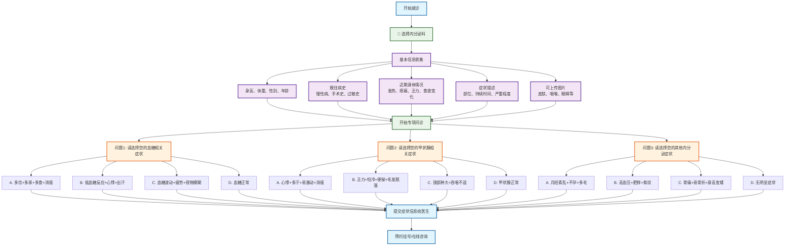

# 内分泌科分诊流程图

## 内分泌科专项问诊

### 问题设计（选择题格式）
1. **问题1 - 血糖相关症状选择**：
   - A. 多饮+多尿+多食+消瘦
   - B. 低血糖反应+心悸+出汗
   - C. 血糖波动+疲劳+视物模糊
   - D. 血糖正常
   - A. 多饮+多尿+体重下降 → 1型糖尿病
   - B. 多饮+多尿+体重增加 → 2型糖尿病
   - C. 体重异常变化+乏力 → 糖尿病前期
   - D. 无代谢症状 → 继续下一问题

2. **问题2 - 甲状腺相关症状选择**：
   - A. 怕热+心悸+体重下降 → 甲状腺功能亢进
   - B. 怕冷+乏力+体重增加 → 甲状腺功能减退
   - C. 颈部肿大+吞咽困难 → 甲状腺肿大
   - D. 无甲状腺症状 → 继续下一问题

3. **问题3 - 激素相关症状选择**：
   - A. 月经异常+情绪波动 → 性激素紊乱
   - B. 乏力+睡眠障碍+记忆力下降 → 肾上腺功能异常
   - C. 骨痛+肌无力+抽搐 → 甲状旁腺功能异常
   - D. 无明显症状 → 建议全面检查

### 可能诊断
- **糖尿病相关**：1型糖尿病、2型糖尿病、糖尿病前期
- **甲状腺疾病**：甲状腺功能亢进、甲状腺功能减退、甲状腺肿大
- **其他内分泌疾病**：性激素紊乱、肾上腺功能异常、甲状旁腺功能异常

### 使用说明
此流程图采用选择题格式进行内分泌科疾病分诊，涵盖糖尿病、甲状腺疾病、激素紊乱等主要内分泌系统疾病。每个问题提供4个选项，包含症状组合，帮助患者更准确地描述症状，获得更精确的初步诊断建议。
