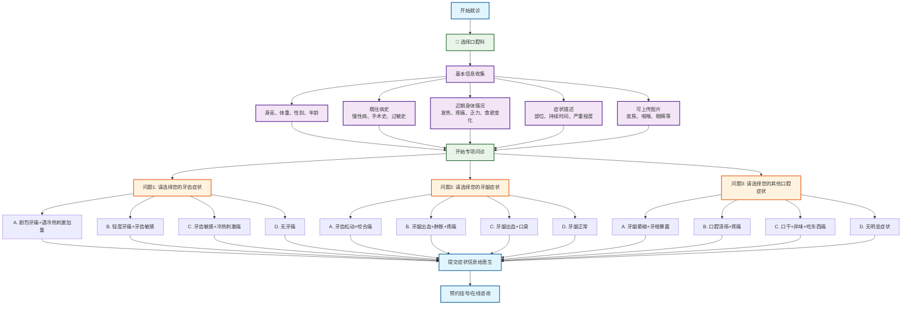

# 口腔科分诊流程图

## 口腔科专项问诊

### 问题设计（选择题格式）
1. **问题1 - 牙齿症状选择**：
   - A. 剧烈牙痛+遇冷热刺激加重
   - B. 轻度牙痛+牙齿敏感
   - C. 牙齿敏感+冷热刺激痛
   - D. 无牙痛
   - A. 剧烈牙痛+遇冷热加重 → 急性牙髓炎
   - B. 轻度牙痛+牙齿敏感 → 龋齿/牙本质敏感
   - C. 牙齿松动+咬合痛 → 牙周炎
   - D. 无牙齿症状 → 继续下一问题

2. **问题2 - 牙龈症状选择**：
   - A. 牙龈出血+肿胀+疼痛 → 急性牙龈炎
   - B. 牙龈出血+口臭 → 慢性牙周炎
   - C. 牙龈萎缩+牙根暴露 → 牙周病
   - D. 牙龈正常 → 继续下一问题

3. **问题3 - 口腔症状选择**：
   - A. 口腔溃疡+疼痛 → 复发性口疮
   - B. 口臭+口干 → 口腔卫生问题/唾液分泌异常
   - C. 舌痛+舌苔变化 → 舌炎/口腔黏膜病
   - D. 无明显症状 → 建议常规检查

### 可能诊断
- **牙齿疾病**：急性牙髓炎、龋齿、牙本质敏感、牙周炎
- **牙龈疾病**：急性牙龈炎、慢性牙周炎、牙周病
- **口腔疾病**：复发性口疮、口腔卫生问题、舌炎、口腔黏膜病

### 使用说明
此流程图采用选择题格式进行口腔科疾病分诊，每个问题提供4个选项，包含症状组合，帮助患者更准确地描述口腔症状，获得更精确的初步诊断建议。
