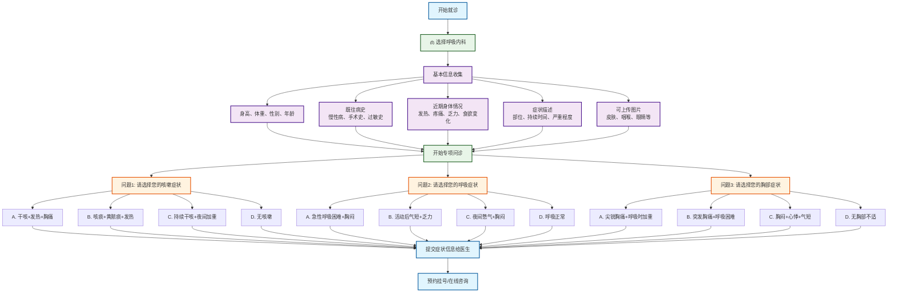

# 呼吸内科分诊流程图

## 呼吸内科专项问诊

### 问题设计（选择题格式）
1. **问题1 - 咳嗽症状选择**：
   - A. 干咳+发热+胸痛 → 
   - B. 咳痰+黄脓痰+发热 → 
   - C. 持续干咳+夜间加重 → 
   - D. 无咳嗽症状 → 
   - A. 干咳+发热+胸痛 → 急性肺炎
   - B. 咳痰+黄脓痰+发热 → 细菌性支气管炎
   - C. 持续干咳+夜间加重 → 哮喘/过敏性咳嗽
   - D. 无咳嗽症状 → 继续下一问题

2. **问题2 - 呼吸症状选择**：
   - A. 急性呼吸困难+胸闷 → 急性哮喘发作
   - B. 活动后气短+乏力 → 慢性阻塞性肺病
   - C. 夜间憊气+胸闷 → 心功能不全/睡眠呼吸暂停
   - D. 呼吸正常 → 继续下一问题

3. **问题3 - 胸部症状选择**：
   - A. 尖锐胸痛+呼吸加重 → 胸膜炎/气胸
   - B. 胸闷+心悸+气短 → 心肺疾病
   - C. 胸痛+咳血+体重下降 → 肺部肿瘤/结核
   - D. 无明显症状 → 建议检查

### 可能诊断
- **感染性疾病**：急性肺炎、细菌性支气管炎
- **慢性疾病**：哮喘、过敏性咳嗽、慢性阻塞性肺病
- **严重疾病**：胸膜炎、气胸、肺部肿瘤、结核、心肺疾病

### 使用说明
此流程图采用选择题格式进行呼吸内科疾病分诊，每个问题提供4个选项，包含症状组合，帮助患者更准确地描述呼吸系统症状，获得更精确的初步诊断建议。
