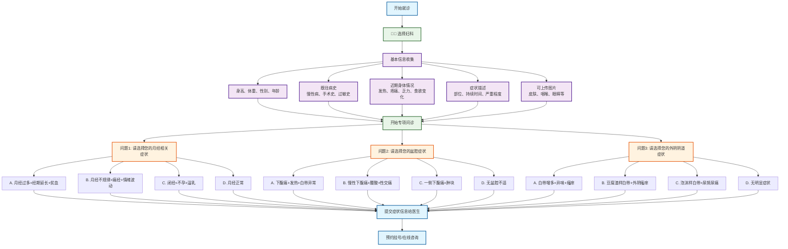

# 妇科分诊流程图

## 妇科专项问诊

### 问题设计（选择题格式）
1. **问题1 - 月经相关症状选择**：
   - A. 月经过多+经期延长+贫血 → 子宫肌瘤/内膜病变
   - B. 月经不规律+痛经+情绪波动 → 内分泌失调/多囊卵巢
   - C. 闭经+不孕+溢乳 → 卵巢功能减退/垂体病变
   - D. 月经正常 → 继续下一问题

2. **问题2 - 盆腔症状选择**：
   - A. 下腹痛+发热+白带异常 → 急性盆腔炎
   - B. 慢性下腹痛+腰酸+性交痛 → 慢性盆腔炎
   - C. 一侧下腹痛+肿块 → 卵巢囊肿/附件炎
   - D. 无盆腔不适 → 继续下一问题

3. **问题3 - 外阴阴道症状选择**：
   - A. 白带增多+异味+瘙痒 → 细菌性阴道炎
   - B. 豆腐渣样白带+外阴瘙痒 → 霉菌性阴道炎
   - C. 泡沫样白带+尿频尿痛 → 滴虫性阴道炎
   - D. 无明显症状 → 建议检查

### 可能诊断
- **月经疾病**：子宫肌瘤、内膜病变、内分泌失调、多囊卵巢
- **盆腔疾病**：急性盆腔炎、慢性盆腔炎、卵巢囊肿、附件炎
- **生殖道感染**：细菌性阴道炎、霉菌性阴道炎、滴虫性阴道炎
- **生育相关**：卵巢功能减退、垂体病变

### 使用说明
此流程图采用选择题格式进行妇科疾病分诊，每个问题提供4个选项，包含症状组合，帮助女性患者更准确地描述妇科症状，获得更精确的初步诊断建议.
