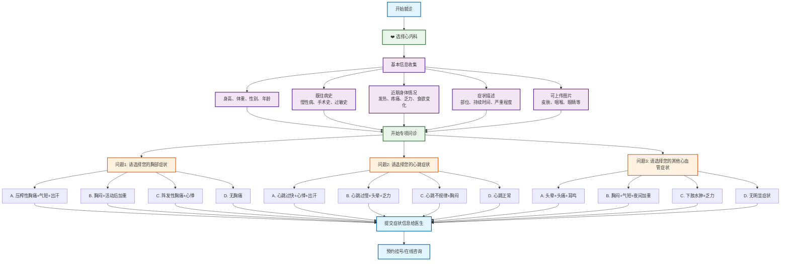

# 心内科分诊流程图

## 心内科专项问诊

### 问题设计（选择题格式）
1. **问题1 - 胸部症状选择**：
   - A. 压榨性胸痛+气短+出汗 → 急性心肌梗死
   - B. 胸闷+活动后加重 → 稳定性心绞痛
   - C. 阵发性胸痛+心悸 → 不稳定性心绞痛
   - D. 无胸部症状 → 继续下一问题

2. **问题2 - 心跳症状选择**：
   - A. 心跳过快+心悸+出汗 → 室上性心动过速
   - B. 心跳过慢+头晕+乏力 → 缓慢性心律失常
   - C. 心跳不规律+胸闷 → 房颇或室性早搏
   - D. 心跳正常 → 继续下一问题

3. **问题3 - 其他心血管症状选择**：
   - A. 下肢水肿+气短+乏力 → 心功能不全
   - B. 头晕+头痛+耳鸣 → 高血压
   - C. 胸闷+气短+夜间加重 → 心血管神经症
   - D. 无明显症状 → 建议检查

### 可能诊断
- **急性心脏病**：急性心肌梗死、不稳定性心绞痛
- **慢性心脏病**：稳定性心绞痛、心功能不全、高血压
- **心律失常**：室上性心动过速、缓慢性心律失常、早搏
- **功能性疾病**：心血管神经症

### 使用说明
此流程图采用选择题格式进行心内科疾病分诊，每个问题提供4个选项，包含症状组合，帮助患者更准确地描述心血管症状，获得更精确的初步诊断建议。
