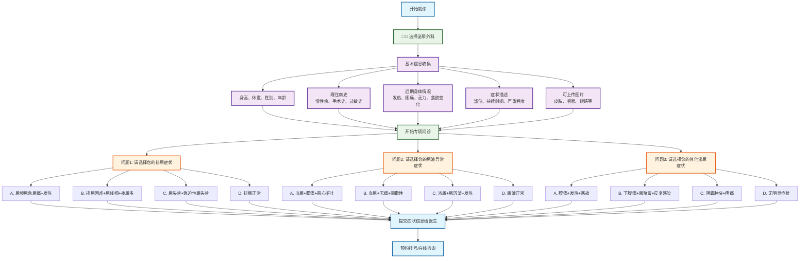

# 泌尿外科分诊流程图

## 泌尿外科专项问诊

### 问题设计（选择题格式）
1. **问题1 - 排尿症状选择**：
   - A. 尿频尿急尿痛+发热 → 急性泌尿系感染
   - B. 排尿困难+尿线细+夜尿多 → 前列腺增生/炎症
   - C. 尿失禁+急迫性尿失禁 → 膜胱功能障碍
   - D. 排尿正常 → 继续下一问题

2. **问题2 - 尿液异常症状选择**：
   - A. 血尿+腰痛+恶心呕吐 → 肾结石/输尿管结石
   - B. 血尿+无痛+间歇性 → 膜胱肿瘤/肾肿瘤
   - C. 浓尿+尿沉渣+发热 → 泌尿系感染
   - D. 尿液正常 → 继续下一问题

3. **问题3 - 其他泌尿症状选择**：
   - A. 腰痛+发热+寒战 → 急性肾盂肾炎
   - B. 下腹痛+尿潴留+反复感染 → 慢性前列腺炎
   - C. 阴囊肿块+疼痛 → 附睾炎/精索静脉曲张
   - D. 无明显症状 → 建议检查

### 可能诊断
- **感染性疾病**：急性泌尿系感染、泌尿系感染、急性肾盂肾炎
- **前列腺疾病**：前列腺增生、前列腺炎症、慢性前列腺炎
- **结石疾病**：肾结石、输尿管结石
- **肿瘤疾病**：膜胱肿瘤、肾肿瘤
- **其他疾病**：膜胱功能障碍、附睾炎、精索静脉曲张

### 使用说明
此流程图采用选择题格式进行泌尿外科疾病分诊，每个问题提供4个选项，包含症状组合，帮助患者更准确地描述泌尿系统症状，获得更精确的初步诊断建议。
