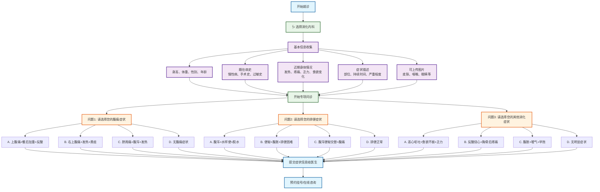

# 消化内科分诊流程图

## 消化内科专项问诊

### 问题设计（选择题格式）
1. **问题1 - 腹痛症状选择**：
   - A. 上腹痛+餐后加重+反酸 → 胃炎/消化性溃疡
   - B. 右上腹痛+发热+黄疸 → 胆囊炎/胆石症
   - C. 脐周痛+腹泻+发热 → 急性肠炎
   - D. 无腹痛症状 → 继续下一问题

2. **问题2 - 排便症状选择**：
   - A. 腹泻+水样便+脱水 → 急性胃肠炎
   - B. 便秘+腹胀+排便困难 → 功能性便秘
   - C. 腹泻便秘交替+腹痛 → 肠易激综合征
   - D. 排便正常 → 继续下一问题

3. **问题3 - 其他消化症状选择**：
   - A. 恶心呕吐+食欲不振+乏力 → 胃炎/肝胆疾病
   - B. 反酸烧心+胸骨后疼痛 → 胃食管反流病
   - C. 腹胀+嗳气+早饱 → 功能性消化不良
   - D. 无明显症状 → 建议检查

### 可能诊断
- **胃部疾病**：胃炎、消化性溃疡、胃食管反流病
- **肝胆疾病**：胆囊炎、胆石症、肝胆疾病
- **肠道疾病**：急性肠炎、急性胃肠炎、肠易激综合征、功能性便秘
- **功能性疾病**：功能性消化不良

### 使用说明
此流程图采用选择题格式进行消化内科疾病分诊，每个问题提供4个选项，包含症状组合，帮助患者更准确地描述消化系统症状，获得更精确的初步诊断建议。
