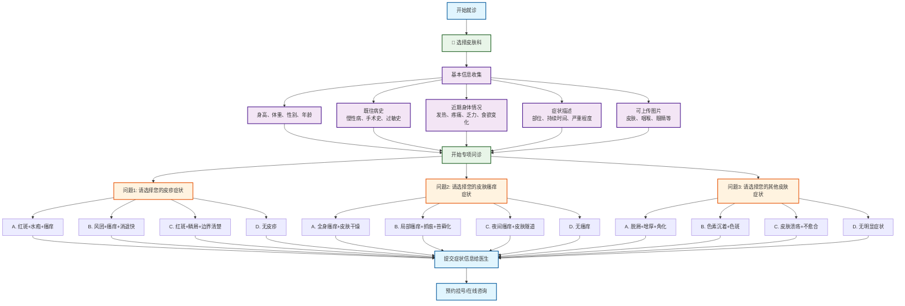

# 皮肤科分诊流程图

## 皮肤科专项问诊

### 问题设计（选择题格式）
1. **问题1 - 皮疹症状选择**：
   - A. 红斑+水疱+瘙痒 → 急性湿疹/接触性皮炎
   - B. 风团+瘙痒+消退快 → 荔麻疹
   - C. 红斑+鳞屑+边界清楚 → 银屑病/真菌感染
   - D. 无皮疹 → 继续下一问题

2. **问题2 - 皮肤瘙痒症状选择**：
   - A. 全身瘙痒+皮肤干燥 → 干燥性皮炎/老年性瘙痒
   - B. 局部瘙痒+抓痕+苔藓化 → 神经性皮炎
   - C. 夜间瘙痒+皮肤隧道 → 疥疮
   - D. 无瘙痒 → 继续下一问题

3. **问题3 - 其他皮肤症状选择**：
   - A. 脱屑+增厚+角化 → 银屑病/角化病
   - B. 色素沉着+色斑 → 色素性疾病
   - C. 皮肤溃疡+不愈合 → 慢性溃疡/皮肤肿瘤
   - D. 无明显症状 → 建议检查

### 可能诊断
- **炎症性皮肤病**：急性湿疹、接触性皮炎、银屑病、真菌感染
- **过敏性皮肤病**：荔麻疹、干燥性皮炎、神经性皮炎
- **感染性皮肤病**：疥疮
- **其他皮肤病**：角化病、色素性疾病、慢性溃疡、皮肤肿瘤

### 使用说明
此流程图采用选择题格式进行皮肤科疾病分诊，每个问题提供4个选项，包含症状组合，帮助患者更准确地描述皮肤症状，获得更精确的初步诊断建议。
