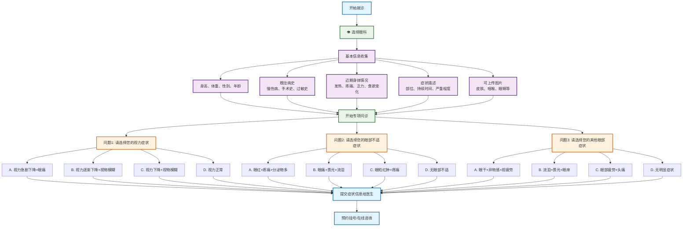

# 眼科分诊流程图

## 眼科专项问诊

### 问题设计（选择题格式）
1. **问题1 - 视力相关症状选择**：
   - A. 视力急剧下降+眼痛 → 急性青光眼
   - B. 视力逐渐下降+视物模糊 → 白内障/屈光不正
   - C. 视野缺损+头痛 → 青光眼
   - D. 视力正常 → 继续下一问题

2. **问题2 - 眼部不适症状选择**：
   - A. 眼红+疼痛+分泌物 → 急性结膜炎
   - B. 眼痛+畏光+流泪 → 角膜炎
   - C. 眼睑红肿+疼痛 → 麦粒肿/睑缘炎
   - D. 无眼部疼痛 → 继续下一问题

3. **问题3 - 其他眼部症状选择**：
   - A. 眼干+异物感+视疲劳 → 干眼症
   - B. 流泪+畏光+眼痒 → 过敏性结膜炎
   - C. 眼前黑影+闪光感 → 玻璃体混浊/视网膜病变
   - D. 无明显症状 → 建议常规检查

### 可能诊断
- **视力相关疾病**：急性青光眼、白内障、屈光不正、青光眼
- **眼部炎症**：急性结膜炎、角膜炎、麦粒肿、睑缘炎
- **眼表疾病**：干眼症、过敏性结膜炎、玻璃体混浊、视网膜病变

### 使用说明
此流程图采用选择题格式进行眼科疾病分诊，每个问题提供4个选项，包含症状组合，帮助患者更准确地描述眼部症状，获得更精确的初步诊断建议.
