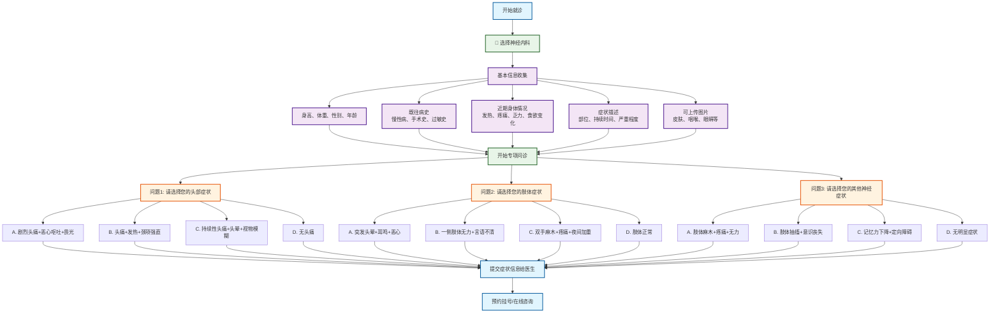

# 神经内科分诊流程图

## 神经内科专项问诊

### 问题设计（选择题格式）
1. **问题1 - 头部症状选择**：
   - A. 剧烈头痛+恶心呕吐+畏光 → 偏头痛/脑膜炎
   - B. 持续性头痛+头晕+视物模糊 → 高血压性头痛
   - C. 突发头晕+耳鸣+恶心 → 美尼尔病/前庭功能障碍
   - D. 无头部症状 → 继续下一问题

2. **问题2 - 肢体症状选择**：
   - A. 一侧肢体无力+言语不清 → 急性脑卒中
   - B. 双手麻木+疼痛+夜间加重 → 腕管综合征/周围神经病
   - C. 肢体抽搐+意识丧失 → 癣痫发作
   - D. 肢体正常 → 继续下一问题

3. **问题3 - 认知症状选择**：
   - A. 记忆力下降+定向障碍 → 阿尔茨海默病/认知障碍
   - B. 手震颤+行动迟缓+肌强直 → 帕金森病
   - C. 情绪波动+睡眠障碍 → 抑郁症/焦虑症
   - D. 无明显症状 → 建议检查

### 可能诊断
- **头部疾病**：偏头痛、脑膜炎、高血压性头痛、美尼尔病
- **运动系统疾病**：急性脑卒中、腕管综合征、周围神经病、癣痫
- **认知功能疾病**：阿尔茨海默病、帕金森病、抑郁症、焦虑症

### 使用说明
此流程图采用选择题格式进行神经内科疾病分诊，每个问题提供4个选项，包含症状组合，帮助患者更准确地描述神经系统症状，获得更精确的初步诊断建议。
