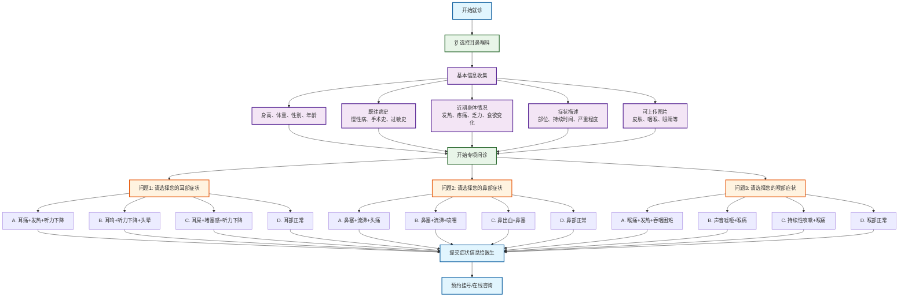

# 耳鼻喉科分诊流程图

## 耳鼻喉科专项问诊

### 问题设计（选择题格式）
1. **问题1 - 耳部症状选择**：
   - A. 耳痛+发热+听力下降
   - B. 耳鸣+听力下降+头晕
   - C. 耳屎+堵塞感+听力下降
   - D. 耳部正常
   - A. 耳鸣+听力下降 → 感音神经性耳聋
   - B. 耳痛+发热 → 急性中耳炎
   - C. 耳闷+听力下降 → 分泌性中耳炎
   - D. 无耳部症状 → 继续下一问题

2. **问题2 - 鼻部症状选择**：
   - A. 鼻塞+黄脓涕 → 急性鼻窦炎
   - B. 鼻塞+清涕+打喷嚏 → 过敏性鼻炎
   - C. 鼻塞+嗅觉减退 → 慢性鼻炎
   - D. 无鼻部症状 → 继续下一问题

3. **问题3 - 咽喉症状选择**：
   - A. 咽痛+发热+吞咽困难 → 急性扁桃体炎
   - B. 声音嘶哑+咽干 → 慢性咽炎/声带炎
   - C. 咽部异物感+干咳 → 慢性咽炎
   - D. 无明显症状 → 建议全面检查

### 可能诊断
- **耳部疾病**：感音神经性耳聋、急性中耳炎、分泌性中耳炎
- **鼻部疾病**：急性鼻窦炎、过敏性鼻炎、慢性鼻炎
- **咽喉疾病**：急性扁桃体炎、慢性咽炎、声带炎

### 使用说明
此流程图采用选择题格式进行耳鼻喉科疾病分诊，每个问题提供4个选项，包含症状组合，使诊断更加精确和专业。患者可根据自身症状选择最符合的选项，系统将给出相应的初步诊断建议。
