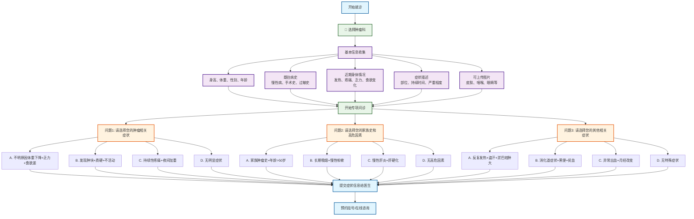

# 肿瘤科分诊流程图

## 肿瘤科专项问诊

### 问题设计（选择题格式）
1. **问题1 - 肿瘤相关症状选择**：
   - A. 不明原因体重下降+乏力+食欲差 → 需要全面肿瘤筛查
   - B. 发现肿块+质硬+不活动 → 需要影像学检查和活检
   - C. 持续性疼痛+夜间加重 → 需要疼痛评估和肿瘤排查
   - D. 无明显症状 → 继续下一问题

2. **问题2 - 家族史和高危因素选择**：
   - A. 家族肿瘤史+年龄>50岁 → 建议定期肿瘤筛查
   - B. 长期吸烟+慢性咳嗽 → 建议肺癌筛查
   - C. 慢性肝炎+肝硬化 → 建议肝癌筛查
   - D. 无高危因素 → 继续下一问题

3. **问题3 - 其他相关症状选择**：
   - A. 反复发热+盗汗+淤巴结肿大 → 需要血液系统肿瘤排查
   - B. 消化道症状+黑便+贫血 → 需要消化道肿瘤排查
   - C. 异常出血+月经改变 → 需要妇科肿瘤排查
   - D. 无特殊症状 → 建议定期健康体检

### 筛查建议
- **紧急筛查**：全面肿瘤筛查、影像学检查和活检、疼痛评估
- **专项筛查**：肺癌筛查、肝癌筛查、血液系统肿瘤排查
- **系统筛查**：消化道肿瘤排查、妇科肿瘤排查
- **预防性筛查**：定期肿瘤筛查、定期健康体检

### 使用说明
此流程图采用选择题格式进行肿瘤科疾病分诊，每个问题提供4个选项，包含症状组合和高危因素，帮助患者和医生更准确地评估肿瘤风险，制定合适的筛查方案.
