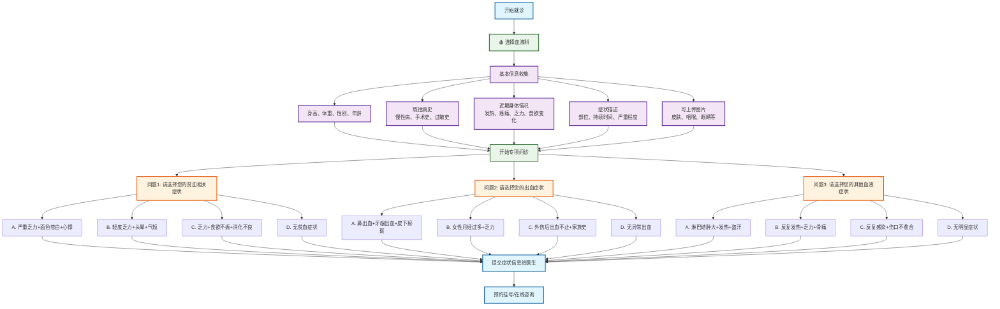

# 血液科分诊流程图

## 血液科专项问诊

### 问题设计（选择题格式）
1. **问题1 - 贫血相关症状选择**：
   - A. 严重乏力+面色苍白+心悸 → 重度贫血
   - B. 轻度乏力+头晕+气短 → 轻中度贫血
   - C. 乏力+食欲不振+消化不良 → 缺铁性贫血
   - D. 无贫血症状 → 继续下一问题

2. **问题2 - 出血症状选择**：
   - A. 鼻出血+牙龈出血+皮下瘀斑 → 血小板减少症
   - B. 女性月经过多+乏力 → 缺铁性贫血
   - C. 外伤后出血不止+家族史 → 凝血功能障碍
   - D. 无异常出血 → 继续下一问题

3. **问题3 - 其他血液症状选择**：
   - A. 淋巴结肿大+发热+盗汗 → 淋巴瘤
   - B. 反复发热+乏力+骨痛 → 白血病
   - C. 反复感染+伤口不愈合 → 免疫功能低下
   - D. 无明显症状 → 建议检查

### 可能诊断
- **贫血类疾病**：重度贫血、轻中度贫血、缺铁性贫血
- **出血性疾病**：血小板减少症、凝血功能障碍
- **血液系统肿瘤**：淋巴瘤、白血病
- **免疫系统疾病**：免疫功能低下

### 使用说明
此流程图采用选择题格式进行血液科疾病分诊，每个问题提供4个选项，包含症状组合，帮助患者更准确地描述血液系统症状，获得更精确的初步诊断建议。
