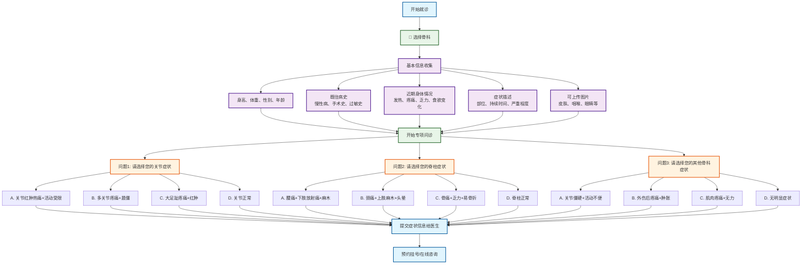

# 骨科分诊流程图

## 骨科专项问诊

### 问题设计（选择题格式）
1. **问题1 - 关节症状选择**：
   - A. 关节红肿热痛+活动受限 → 急性关节炎
   - B. 多关节疼痛+晨僵 → 类风湿性关节炎
   - C. 大足趾疼痛+红肿 → 痛风性关节炎
   - D. 关节正常 → 继续下一问题

2. **问题2 - 脊柱症状选择**：
   - A. 腰痛+下肢放射痛+麻木 → 腰椎间盘突出
   - B. 颈痛+上肢麻木+头晕 → 颈椎病
   - C. 胸背痛+呼吸加重 → 胸椎病变
   - D. 脊柱正常 → 继续下一问题

3. **问题3 - 外伤/骨病症状选择**：
   - A. 外伤后疼痛+肿胀+功能障碍 → 骨折/软组织损伤
   - B. 骨痛+乏力+易骨折 → 骨质疏松症
   - C. 关节僵硬+活动不便 → 骨关节炎
   - D. 无明显症状 → 建议检查

### 可能诊断
- **关节疾病**：急性关节炎、类风湿性关节炎、痛风性关节炎
- **脊柱疾病**：腰椎间盘突出、颈椎病、胸椎病变
- **骨病/外伤**：骨折、软组织损伤、骨质疏松症、骨关节炎

### 使用说明
此流程图采用选择题格式进行骨科疾病分诊，每个问题提供4个选项，包含症状组合，帮助患者更准确地描述骨骼肌肉系统症状，获得更精确的初步诊断建议。
